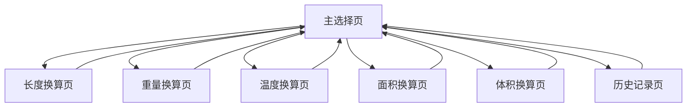

# QuickUnitConverter 产品需求文档

## 1. 产品概述

QuickUnitConverter 是一款iOS单机工具类应用，专注于提供快速、准确的单位换算功能。应用采用无登录、无网络请求、无数据收集的设计原则，确保用户隐私安全。

- 核心功能：支持5类单位（长度、重量、温度、面积、体积）的实时换算，响应时间控制在0.5秒内
- 目标用户：需要日常单位换算的普通用户，包括学生、工程师、厨师等
- 市场价值：提供简洁高效的单位换算工具，满足用户快速换算需求

## 2. 核心功能

### 2.1 用户角色
本应用无需用户注册登录，所有用户享有相同功能权限。

### 2.2 功能模块

我们的单位换算应用包含以下主要页面：

1. **主选择页**：单位分类列表，历史记录入口
2. **换算操作页**：数值输入，单位选择，结果显示
3. **历史记录页**：查看最近换算记录

### 2.3 页面详情

| 页面名称 | 模块名称 | 功能描述 |
|---------|---------|----------|
| 主选择页 | 单位分类列表 | 显示5个单位分类（长度、重量、温度、面积、体积），每个分类带有SF Symbols图标，点击进入对应换算页面 |
| 主选择页 | 历史记录入口 | 显示历史记录按钮，仅当有记录时显示，点击查看最近10条换算记录 |
| 主选择页 | 版权信息 | 底部显示"©2024 完全免费使用"版权声明 |
| 换算操作页 | 数值输入区 | 提供数字键盘输入，限制15字符，支持小数点，实时校验数字有效性 |
| 换算操作页 | 单位显示区 | 显示当前选中的输入单位和输出单位 |
| 换算操作页 | 结果显示区 | 实时显示换算结果，字号比输入区放大20%，支持防抖处理 |
| 换算操作页 | 单位选择器 | 使用UIPickerView提供单位切换，每类单位提供4-6个选项 |
| 换算操作页 | 剪贴板功能 | 长按输入框可粘贴系统剪贴板内容 |
| 历史记录页 | 记录列表 | 显示最近10条换算记录，包含换算类型、数值、单位信息 |
| 历史记录页 | 记录管理 | 支持先进先出的记录存储，自动清理超出限制的旧记录 |

## 3. 核心流程

用户使用流程：
1. 用户打开应用进入主选择页
2. 选择需要换算的单位类型（如重量）
3. 进入换算操作页，输入数值
4. 系统实时显示换算结果
5. 用户可切换输出单位查看不同结果
6. 换算记录自动保存到历史记录
7. 用户可通过历史记录按钮查看过往记录

## 4. 用户界面设计

### 4.1 设计风格

- **主色调**：系统蓝色 (#007AFF)，辅助色为浅灰色 (#F2F2F7)
- **按钮样式**：圆角矩形按钮，遵循iOS设计规范
- **字体**：系统默认字体 San Francisco，输入区使用17pt，结果区使用20pt
- **布局风格**：简洁的列表式布局，顶部导航栏设计
- **图标风格**：使用SF Symbols系统图标，保持一致性

### 4.2 页面设计概览

| 页面名称 | 模块名称 | UI元素 |
|---------|---------|--------|
| 主选择页 | 导航栏 | 标准iOS导航栏，标题"单位转换器"，背景色白色 |
| 主选择页 | 分类列表 | UITableView，每行包含SF Symbol图标和分类名称，分割线浅灰色 |
| 主选择页 | 版权信息 | 底部居中显示，字号14pt，颜色浅灰色 |
| 换算操作页 | 输入区域 | 白色背景卡片，包含UITextField和单位标签，圆角8pt |
| 换算操作页 | 结果区域 | 浅蓝色背景卡片，大号字体显示结果，圆角8pt |
| 换算操作页 | 选择器 | UIPickerView，标准样式，位于页面下半部分 |
| 历史记录页 | 记录列表 | UITableView，每行显示换算信息，时间戳右对齐 |

### 4.3 响应式设计

应用专为iPhone竖屏设计，适配iOS 12+系统，无需iPad适配。界面采用Auto Layout确保在不同iPhone尺寸上的兼容性，优化触摸交互体验。