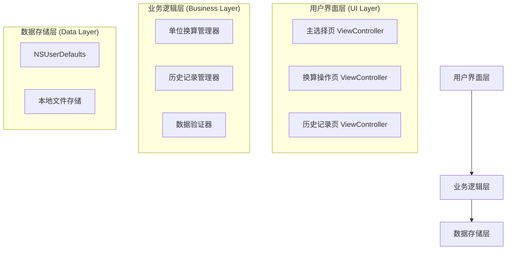
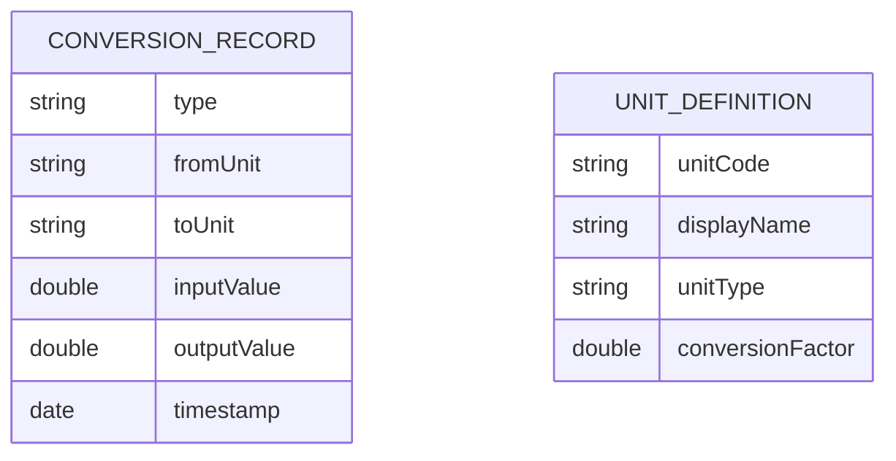

# QuickUnitConverter 技术架构文档

## 1. 架构设计



## 2. 技术描述

* **前端**: Objective-C + UIKit + iOS 12+

* **数据存储**: NSUserDefaults (历史记录)

* **构建工具**: Xcode + iOS SDK

## 3. 路由定义

| 路由                       | 用途                   |
| ------------------------ | -------------------- |
| MainViewController       | 主选择页，显示单位分类列表和历史记录入口 |
| ConversionViewController | 换算操作页，处理单位换算逻辑和用户交互  |
| HistoryViewController    | 历史记录页，显示和管理换算历史      |

## 4. 核心类设计

### 4.1 单位换算管理器 (UnitConversionManager)

```objc
@interface UnitConversionManager : NSObject

// 单位类型枚举
typedef NS_ENUM(NSInteger, UnitType) {
    UnitTypeLength,
    UnitTypeWeight,
    UnitTypeTemperature,
    UnitTypeArea,
    UnitTypeVolume
};

// 换算方法
+ (double)convertValue:(double)value 
              fromUnit:(NSString *)fromUnit 
                toUnit:(NSString *)toUnit 
              unitType:(UnitType)type;

// 获取单位列表
+ (NSArray<NSString *> *)unitsForType:(UnitType)type;

// 获取单位显示名称
+ (NSString *)displayNameForUnit:(NSString *)unit;

@end
```

### 4.2 历史记录管理器 (HistoryManager)

```objc
@interface HistoryManager : NSObject

// 历史记录数据结构
@interface ConversionRecord : NSObject
@property (nonatomic, strong) NSString *type;
@property (nonatomic, strong) NSString *fromUnit;
@property (nonatomic, strong) NSString *toUnit;
@property (nonatomic, assign) double inputValue;
@property (nonatomic, assign) double outputValue;
@property (nonatomic, strong) NSDate *timestamp;
@end

// 历史记录操作
+ (void)saveRecord:(ConversionRecord *)record;
+ (NSArray<ConversionRecord *> *)getRecentRecords;
+ (void)clearAllRecords;
+ (BOOL)hasRecords;

@end
```

### 4.3 数据验证器 (InputValidator)

```objc
@interface InputValidator : NSObject

// 数值验证
+ (BOOL)isValidNumber:(NSString *)input;
+ (double)doubleValueFromString:(NSString *)input;
+ (NSString *)formatNumber:(double)number;

@end
```

## 5. 数据模型

### 5.1 数据模型定义



### 5.2 数据存储结构

**历史记录存储 (NSUserDefaults)**

```objc
// 存储键
static NSString *const kHistoryRecordsKey = @"ConversionHistory";

// 存储格式
@[
    @{
        @"type": @"weight",
        @"fromUnit": @"kg",
        @"toUnit": @"lb",
        @"inputValue": @1.5,
        @"outputValue": @3.307,
        @"timestamp": @"2024-01-01T12:00:00Z"
    }
]
```

**单位换算系数定义**

```objc
// 长度换算 (以米为基准)
NSDictionary *lengthUnits = @{
    @"m": @1.0,
    @"km": @1000.0,
    @"ft": @0.3048,
    @"in": @0.0254,
    @"mile": @1609.34
};

// 重量换算 (以克为基准)
NSDictionary *weightUnits = @{
    @"g": @1.0,
    @"kg": @1000.0,
    @"lb": @453.592,
    @"oz": @28.3495
};

// 温度换算 (特殊处理)
// 摄氏度转华氏度: F = C * 9/5 + 32
// 摄氏度转开尔文: K = C + 273.15

// 面积换算 (以平方米为基准)
NSDictionary *areaUnits = @{
    @"m²": @1.0,
    @"km²": @1000000.0,
    @"ft²": @0.092903,
    @"ha": @10000.0
};

// 体积换算 (以升为基准)
NSDictionary *volumeUnits = @{
    @"L": @1.0,
    @"ml": @0.001,
    @"gal": @3.78541,
    @"ft³": @28.3168
};
```

## 6. 性能优化策略

### 6.1 响应时间优化

* 使用NSTimer实现0.5秒防抖处理

* 预加载单位换算系数到内存

* 异步处理历史记录保存操作

### 6.2 内存管理

* 使用ARC自动内存管理

* 及时释放不需要的视图控制器

* 限制历史记录数量为10条

### 6.3 启动时间优化

* 延迟加载非关键资源

* 简化启动页面逻辑

* 预编译单位换算算法

## 7. 安全与隐私

### 7.1 数据安全

* 所有数据仅存储在本地设备

* 不进行任何网络请求

* 不收集用户个人信息

### 7.2 权限要求

* 无需申请任何系统权限

* 不访问用户通讯录、位置等敏感信息

* 仅使用基础的数据存储功能

