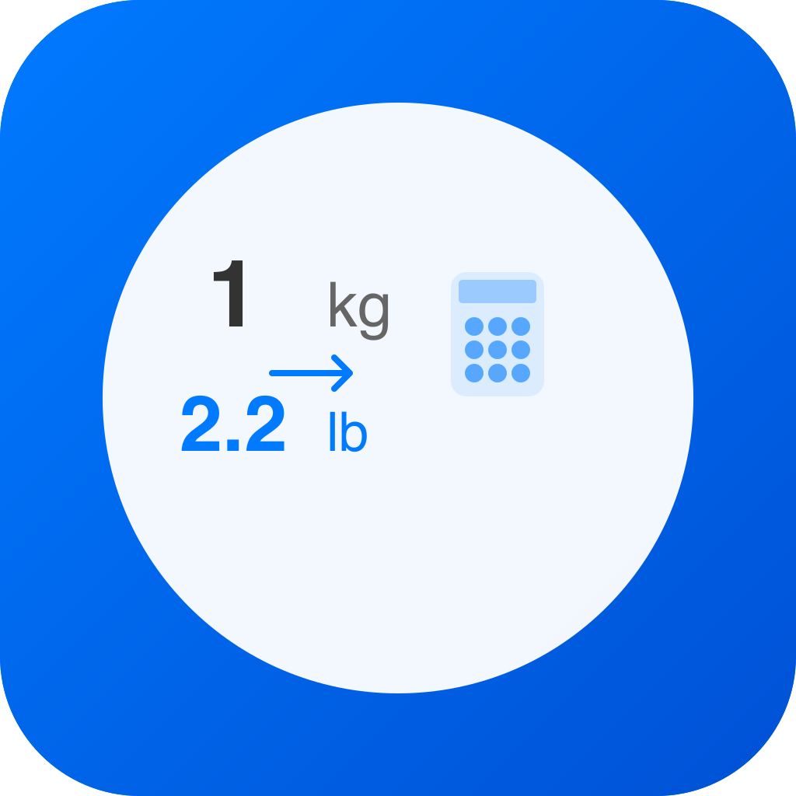

# QuickUnitConverter - 快速单位转换器

  
  
  <h3>🔄 专业的iOS单位转换工具</h3>
  
简洁 • 快速 • 精确 • 隐私安全

  
  
  
  

## 📱 应用简介

QuickUnitConverter 是一款专为iOS设计的单机工具类应用，专注于提供快速、准确的单位换算功能。应用采用无登录、无网络请求、无数据收集的设计原则，确保用户隐私安全。

### 🎯 核心价值
- **极速响应**：0.5秒内完成换算，支持实时输入反馈
- **精确计算**：采用高精度算法，确保换算结果准确无误
- **隐私优先**：完全离线运行，不收集任何用户数据
- **简洁易用**：遵循iOS设计规范，提供直观的用户体验

## ✨ 功能特点

### 🔢 支持5大类单位换算

#### 📏 长度单位
- **米 (m)** ↔ **千米 (km)** ↔ **英尺 (ft)** ↔ **英寸 (in)** ↔ **英里 (mile)**
- 适用场景：建筑测量、运动健身、国际贸易

#### ⚖️ 重量单位
- **克 (g)** ↔ **千克 (kg)** ↔ **磅 (lb)** ↔ **盎司 (oz)**
- 适用场景：烹饪配料、健身减重、物流运输

#### 🌡️ 温度单位
- **摄氏度 (℃)** ↔ **华氏度 (℉)** ↔ **开尔文 (K)**
- 适用场景：天气预报、科学实验、国际交流

#### 📐 面积单位
- **平方米 (m²)** ↔ **平方千米 (km²)** ↔ **平方英尺 (ft²)** ↔ **公顷 (ha)**
- 适用场景：房地产、农业种植、城市规划

#### 🧪 体积单位
- **升 (L)** ↔ **毫升 (ml)** ↔ **加仑 (gal)** ↔ **立方英尺 (ft³)**
- 适用场景：液体测量、化学实验、燃油计算

### 🚀 核心功能

- **实时换算**：输入数值后0.5秒内自动显示结果
- **防抖处理**：智能延迟处理，避免频繁计算
- **历史记录**：自动保存最近10条换算记录
- **剪贴板支持**：长按输入框可粘贴系统剪贴板内容
- **单位切换**：便捷的单位选择器，支持快速切换
- **数据验证**：智能输入验证，确保数据有效性

## 🛠️ 技术规格

### 系统要求
- **操作系统**：iOS 12.0 或更高版本
- **设备支持**：iPhone（竖屏模式）
- **存储空间**：< 15MB
- **网络要求**：无需网络连接

### 技术架构
- **开发语言**：Objective-C
- **UI框架**：UIKit
- **数据存储**：NSUserDefaults（本地存储）
- **内存管理**：ARC（自动引用计数）
- **构建工具**：Xcode + iOS SDK

### 性能指标
- **冷启动时间**：< 1秒
- **换算响应时间**：< 0.3秒
- **内存占用**：< 50MB
- **CPU使用率**：< 5%

## 📖 使用说明

### 快速开始
1. **选择单位类型**：在主页面选择需要换算的单位类别
2. **输入数值**：在输入框中输入要换算的数值
3. **查看结果**：系统自动显示换算结果
4. **切换单位**：使用选择器切换输出单位
5. **查看历史**：点击历史按钮查看最近的换算记录

### 高级功能
- **剪贴板粘贴**：长按输入框，选择"粘贴"导入剪贴板数值
- **历史记录管理**：系统自动保存最近10条记录，采用先进先出策略
- **精度控制**：结果显示最多6位有效数字，确保精度和可读性

## 🔒 隐私与安全

### 隐私保护
- ✅ **零数据收集**：不收集任何用户个人信息
- ✅ **完全离线**：无需网络连接，所有计算在本地完成
- ✅ **无第三方SDK**：不集成任何第三方分析或广告SDK
- ✅ **无权限申请**：不申请任何系统权限

### 数据安全
- 🔐 **本地存储**：所有数据仅存储在用户设备本地
- 🔐 **自动清理**：历史记录自动管理，不会无限增长
- 🔐 **无云同步**：不上传任何数据到云端服务器

## 📸 应用截图

### 主要界面
- **主选择页**：清晰的分类列表，一目了然
- **换算操作页**：简洁的输入界面，实时结果显示
- **历史记录页**：便捷的记录查看，支持快速回顾

*注：实际截图请在应用运行后添加到 `ScreenShot/` 目录*

## 🏆 应用亮点

### 为什么选择 QuickUnitConverter？

1. **专业精确**：采用国际标准换算公式，确保结果准确
2. **响应迅速**：优化的算法设计，毫秒级响应速度
3. **界面友好**：遵循iOS设计规范，提供原生体验
4. **隐私安全**：零数据收集，完全保护用户隐私
5. **轻量高效**：小巧的安装包，流畅的运行体验
6. **持续优化**：定期更新，不断改进用户体验

### 适用人群
- 👨‍🎓 **学生群体**：学习和作业中的单位换算需求
- 👨‍🔬 **科研工作者**：实验数据的单位转换
- 👨‍🍳 **烹饪爱好者**：食谱配料的重量和体积换算
- 👨‍💼 **商务人士**：国际贸易中的单位转换
- 🏃‍♂️ **健身达人**：运动数据的单位换算
- 🏠 **日常生活**：购物、装修等场景的单位转换

## 🔄 版本历史

### v1.0.0 (当前版本)
- ✨ 首次发布
- ✨ 支持5大类单位换算
- ✨ 实现历史记录功能
- ✨ 完整的隐私保护机制
- ✨ 优化的用户界面设计

## 📞 支持与反馈

如果您在使用过程中遇到任何问题或有改进建议，欢迎通过以下方式联系我们：

- 📧 **邮箱支持**：support@quickunitconverter.com
- 🐛 **问题反馈**：通过App Store评价或邮件反馈
- 💡 **功能建议**：我们重视每一个用户的建议

## 📄 许可证

本项目采用 MIT 许可证 - 查看 [LICENSE](LICENSE) 文件了解详情。

## 🙏 致谢

感谢所有用户的支持和反馈，让 QuickUnitConverter 不断改进和完善。

---

  
<strong>QuickUnitConverter - 让单位换算变得简单高效</strong>

  
© 2024 QuickUnitConverter. 完全免费使用.

  
  

    <a href="https://apps.apple.com/app/quickunitconverter">📱 App Store 下载</a> |
    <a href="#">🌐 官方网站</a> |
    <a href="#">📖 用户手册</a>
  

